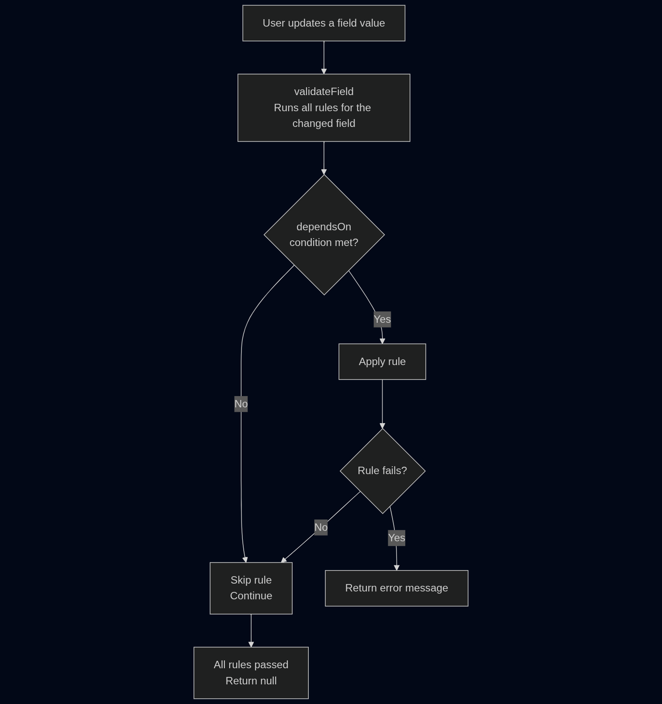

# Form Renderer

The `FormRenderer` component is responsible for dynamically rendering forms based on a provided JSON schema.

## **Key Features**

- Dynamically renders forms based on a JSON schema. - Supported field types using Material-UI components: text, textarea, checkbox, radio, and dropdown. - Handles nested groups of fields. - Supports validation rules for fields. `validateField` function checks for required fields and other validation rules defined in the schema. - Real-time form value updates via the `onChange` handler

## **Validation Flow**

The following diagram illustrates how validation works in the `FormRenderer` component:

